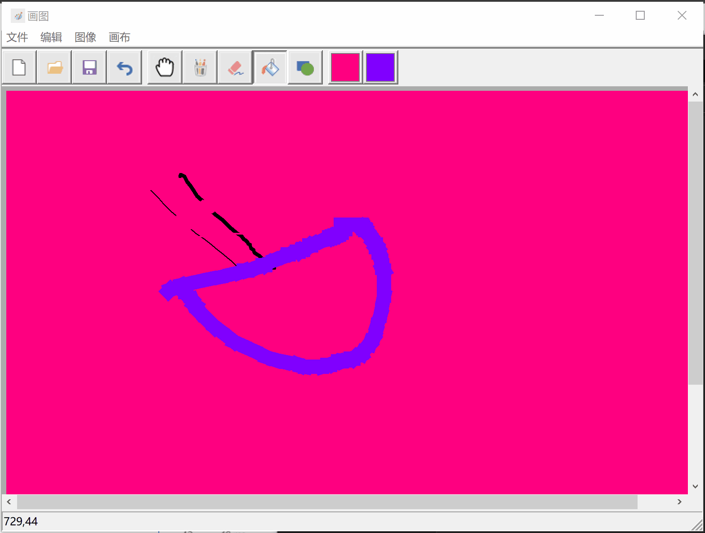

# 汇编部分大作业文档

小组成员：

潘首安、陈启乾、谭弈凡 

## 简介

本程序为采用汇编语言编写的画图程序。

程序的主要功能包括：

+ 拥有基本的画图工具，包括铅笔、橡皮、填充、图形（矩形、椭圆、直线）工具；
+ 画布可以缩放、拖动、滚动；
+ 画布可以调整前景色、背景色；
+ 画笔、橡皮可以调整粗细；
+ 画布可以调整大小；
+ 图形工具可以选择填充方式；
+ 可以撤销上一步的绘画；
+ 可以清空整个画布为背景色；
+ 可以从 bmp 文件打开图片以及保存画布到 bmp 文件；
+ 可以将打开的 bmp 文件编辑后直接保存或另存到指定位置；
+ 可以通过新建功能，直接退出当前文件编辑进行新的绘图。

### 开发环境

使用 Visual Studio 2019 和 masm32 汇编器在 Windows 10 下开发。

## 使用方法

双击打开可执行文件即可。

从上往下依次为：菜单栏、工具栏、画布、状态栏。

菜单栏和工具栏可以选择绘图工具或进行操作。

在菜单栏或工具栏选中工具后，点击画布即可进行绘制。

状态栏显示当前光标在画布上的位置。

### 画笔工具

 

### 橡皮工具

### 油漆工具

### 撤销

### 图形

### 缩放、拖动

### 改变画布大小

### 保存

### 加载

## 实现原理

### 绘图原理

程序采用 Win32 API 进行绘图，主要运用 GDI 模块。这个模块颇为复杂，在下面做一点微小 的说明。

---

GDI 模块中画图的关键概念是 [Device Contexts](https://docs.microsoft.com/en-us/windows/win32/gdi/device-contexts) [^1]。微软官方文档中说：

> A DC is a structure that defines a set of graphic objects and their associated attributes, and the graphic modes that affect output. The graphic objects include a pen for line drawing, a brush for painting and filling, a bitmap for copying or scrolling parts of the screen, a palette for defining the set of available colors, a region for clipping and other operations, and a path for painting and drawing operations. Unlike most of the structures, an application never has direct access to the DC; instead, it operates on the structure indirectly by calling various functions.[^2]

简单理解的话，Device Contexts 是 GDI 在**可以画图的对象**上 1) 画的“图形“，2) 调用其他函数（[LineTo](https://docs.microsoft.com/en-us/windows/win32/api/wingdi/nf-wingdi-lineto)，[Rectangle](https://docs.microsoft.com/en-us/windows/win32/api/wingdi/nf-wingdi-rectangle)）在对象上画图时的默认设置，这两者的结合体。例如画图需要在一块画布上画，就是对应 Device Contexts 中的 Bitmap 元素；例如画图需要笔（Pen），画图形需要填充（Brush），这些也在 Device Contexts 中有所体现。这些”默认配置“一般也是可以在具体画图的时候进行覆盖的，除 Bitmap 外。

具体实现上，Device Context 保存了各一个指向 Bitmap，Pen，Brush，Region ( Windows 称之为图形对象，Graphics Objects) 等的 Handle，并采用 SelectObject 将一个某类的图形对象选入 Device Contexts ，同时返回之前 Device Contexts 中的（，在这次选择后被踢走的）该类对象。

---

Device Context 出现的动机是把编程者（用户）的操作和物理的设备之间加上一层隔离，让用户可控地操控硬件，事实上是一层缓冲区。[^3]

GDI 绝大部分的画图函数的第一个参数即为 hDC，是 Device Contexts 的 Handle；

创建 Device Contexts 时需要指出定义中所说的可以画图的（表现画图操作结果的）对象是什么，在下面双重缓冲的策略中用到的是显示器和内存【如果是内存的话，就是 Compatible  Device Context】。

[^1]: 中文直接翻译为“设备上下文”，但事实上 Contexts 很难找到一个完全对应的中文概念，因此下面就不做翻译。
[^2]: [About Device Contexts - Win32 apps | Microsoft Docs](https://docs.microsoft.com/en-us/windows/win32/gdi/about-device-contexts)

[^3]: 但既然可以搭一层缓冲区，那么就可以再来一层如果把”绘图的目的地“换成内存，就构成了双重缓冲。

---

画图策略上，程序采用双缓冲的方法进行绘图。具体来说，在画布窗口的 [Display Device Contexts](https://docs.microsoft.com/en-us/windows/win32/gdi/display-device-contexts) 之外，保存一个与之 [Compatible](https://docs.microsoft.com/en-us/windows/desktop/api/Wingdi/nf-wingdi-createcompatibledc) 的，内容一致的 [Memory Device Contexts](https://docs.microsoft.com/en-us/windows/win32/gdi/memory-device-contexts) 于内存之中 。在用户使用鼠标在画布上开始绘画（ButtonDown or MouseMove）时，我们复制一份当前窗口在内存中存储的 Memory Device Contexts 作为缓冲区，将用户的行为绘制到缓冲区中，随后将缓冲区复制到窗口的 Display Device Contexts 之中，并且禁用背景重绘，得到重新绘制的画布。在用户结束绘画（ButtonUp）时，我们将缓冲区的内容复制回窗口对应的 Memory Device Contexts 和窗口自身的 Display Device Contexts；并清除缓冲区。因为向屏幕上的直接绘制较慢，而向内存绘制，再从内存拷贝到屏幕较快；这样的双缓冲绘图方法可以减少窗口的闪烁，加快窗口的响应速度。

绘图核心的过程是将图片复制和转移。下面列举了一些复制的方法：

1. 从 HDC 到 HBITMAP：GetDC（canvas），CreateCompatibleDC（新CDC） ，CreateCompatibleBitmap（新 CDC 通过SelectObject 绑到其上），BitBlt  复制老 DC 到新 DC

2. 从 HBITMAP 到 HDC：CreateCompatiableBitmap（新建一个 HBITMAP ），（目标HDC）SelectObject 中 Select HBITMAP 。

3. 从 HDC 到 HDC：直接采用 [BitBlt](https://docs.microsoft.com/en-us/windows/win32/api/wingdi/nf-wingdi-bitblt) 复制

4. 从 HBITMAP 到 HBITMAP：结合 2 与 1 。

具体的画图，采用了 Win32 API 自带的函数，包括：

+ 画笔、橡皮、画直线的 [LineTo](https://docs.microsoft.com/en-us/windows/win32/api/wingdi/nf-wingdi-lineto) 函数
+ 画矩形的 [Rectangle](https://docs.microsoft.com/en-us/windows/win32/api/wingdi/nf-wingdi-rectangle) 函数
+ 画椭圆的 [Ellipse](https://docs.microsoft.com/en-us/windows/win32/api/wingdi/nf-wingdi-ellipse) 函数

### 撤回原理

程序维护一个长度为64的 mBitmap 结构体数组作为绘图的历史记录。 mBitmap 中包含位图句柄及该位图的长度和高度。每次进行绘图前，将索引量 Index 对应的位图更新到绘图缓冲区，再拷贝到窗口对应的 Display Device Contexts 。当完成一次操作后(绘制、擦除、填充、改变画布大小等)，程序将绘图缓冲区中的图像拷贝到绘图历史记录数组的 Index+1 的位置，并将 Index 自增。当进行撤回时，程序将 Index-1 位置的位图更新到绘图缓冲区，再拷贝至窗口对应的 Display Device Contexts ，完成撤回。

### 载入和保存原理

载入功能：程序先调用 Win32 GetOpenFileName 函数使用户选择 .bmp 文件，并保存其路径到变量。其次调用  Win32 LoadImage 函数获取保存路径对应位图的句柄。再生成一个与画布相兼容的 Device Context，调用 Win32  SelcectObject 函数将之与位图绑定。然后调用 Win32 BitBlt 函数将之复制到画布的绘图缓冲区。最后调用开发绘图功能时编写的绘图缓冲区与位图历史记录转换函数将图像保存到位图。

保存功能：首先定义一个函数 CreateBitmapInfoStruct ，使用 BITMAPINFO 结构并为 BITMAPINFOHEADER 结构中的成员分配内存并对其进行初始化。再定义 SaveBitmapToFile 函数初始化其余的结构，检索调色板索引的数组，打开文件，复制数据并关闭文件[^4]。具体实现如下：

在 CreateBitmapInfoStruct 函数中，检索位图颜色、格式、宽度和高度；将颜色格式转化为位数；为 BITMAPINFO 结构分配内存(包含一个 BITMAPINFOHEADER 结构和一个 RGBQUAD 数组)；初始化 BITMAPINFO 结构的字段；计算颜色数组中的字节索引并储存结果到 biSizeImage 中。在 SaveBitmapToFile 函数中，调用 CreateBitmpInfoStruct 函数获取待保存位图的 BITMAPINFO 句柄；检索颜色表和来自 DIB 的调色板索引数组；创建位图文件，通过文件句柄为文件大小、颜色索引数组偏移量等参数赋值；将颜色索引数组、RGBQUAD 数组及 BITMAPINFOHEADER 等结构拷贝至BMP文件；关闭 BMP 文件。由此，完成了位图的保存。

[^4]: 这部分内容参考：[Windows应用开发_存储图像]([存储图像 - Win32 apps | Microsoft Docs](https://docs.microsoft.com/zh-cn/windows/win32/gdi/storing-an-image?redirectedfrom=MSDN))

## 难点和创新点

1. Win32 API 数量庞杂，文档质量不高，熟悉 Win32 的 API 颇花了一些时间。工具栏添加前景色、背景色功能需要改变按钮图标并重新覆盖，这部分接口比较难找。此外，Win32没有保存.bmp文件的函数，需要根据位图句柄，构造位图结构再进行保存，过程比较繁琐。
2. 汇编语言比较复杂，编写较大规模工程时不太方便，且调试时没有C++等语言方便，编写过程中有时出现关于寄存器使用的bug，比较难于发现。
3. 相比于传统的画图，我们增加了拖拽功能，方便用户放大图片后进行较精细的绘图。
4. 我们改造了绘制图形的功能，使之可以选择填充模式（无填充、填充前景色、填充背景色）。用户绘图可以有更多选择，比较方便。
5. 双缓冲的画图虽然使用户体验得以提高，但是也增加了代码量，项目代码达到 2000 行以上。

## 小组分工       

潘首安：搭建主窗口程序框架；编写工具栏、菜单栏及资源文件；开发选择前景色/背景色的功能；开发载入/保存/另存.bmp格式图片功能；开发新建、撤回和清空功能；开发改变画布大小功能；编写绘图缓冲区和历史位图记录传输的函数接口。

陈启乾：搭建画布基础框架；开发画笔和图形工具；开发双缓冲画图功能；开发坐标变换功能；开发画布的缩放、拖拽、滚动功能。

谭弈凡：开发当前光标坐标显示功能；开发橡皮光标与其自适应背景色功能。

## 彩蛋～

